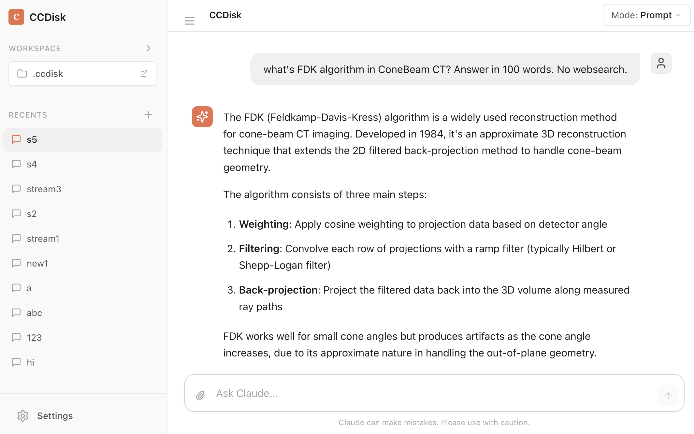

# CCDisk

[English](README.md) | 简体中文

<div align="center">



**强大的 Claude AI 桌面图形界面，具备高级工作区管理和可扩展性**

[](https://www.electronjs.org/)
[](https://reactjs.org/)
[](https://www.typescriptlang.org/)
[](LICENSE)

</div>

---

## 概述

**CCDisk** 是一款原生桌面应用程序，为 Claude AI 提供完整的图形界面。基于 Electron、React 和 TypeScript 构建，提供精致的聊天体验，具备强大的工作区管理、实时流式响应，以及通过技能、命令和 MCP 服务器实现的可扩展性。

### 主要特性

- **🤖 实时 Claude AI 聊天** - 流式响应，支持语法高亮、数学公式渲染和 Mermaid 图表
- **📁 工作区管理** - 文件树浏览器，支持实时监控和语法高亮预览
- **🔐 权限控制** - 精细控制工具执行，内联审批界面
- **🔌 MCP 服务器支持** - 通过模型上下文协议扩展 Claude 能力
- **🎯 技能与命令** - 创建可复用的 AI 行为模式和可执行脚本
- **💾 会话持久化** - 恢复之前的对话，保留完整上下文
- **🌍 多提供商支持** - 管理多个 Claude API 配置
- **⚡ Token 追踪** - 实时查看 API 使用量和成本

---

## 快速开始

### 环境要求

- **Node.js** 18+ 和 **pnpm**（必需）
- **Claude API 密钥**，可从 [Anthropic Console](https://console.anthropic.com/) 获取

### 安装

```bash
# 克隆仓库
git clone https://github.com/yourusername/ccdisk.git
cd ccdisk

# 安装依赖
pnpm install

# 启动开发服务器
pnpm dev
```

### 首次运行

1. 启动应用
2. 选择一个工作区目录（包含你的代码/项目的任意文件夹）
3. 在 **设置 → 提供商** 中添加 Claude API 密钥
4. 开始聊天！

---

## 构建

构建平台特定的安装包：

```bash
# 为当前平台构建
pnpm build

# 为特定平台构建
pnpm build:mac     # macOS .dmg
pnpm build:win     # Windows 安装程序
pnpm build:linux   # Linux 软件包

# 构建但不打包（用于测试）
pnpm build:unpack
```

---

## 架构

### 技术栈

**前端**

- React 19 + TypeScript
- Zustand 状态管理
- Lexical 富文本编辑器
- Radix UI 组件
- Tailwind CSS 样式
- Lucide React 图标

**后端（Electron 主进程）**

- Claude Agent SDK 用于 AI 交互
- better-sqlite3 本地数据库
- Drizzle ORM 类型安全查询
- Chokidar 文件监控

**构建工具**

- electron-vite 打包
- electron-builder 封装
- ESLint + Prettier 代码质量

### 项目结构

```
src/
├── main/              # Electron 主进程
│   ├── services/      # 业务逻辑（DatabaseService、ClaudeService 等）
│   ├── ipc/          # 渲染进程通信的 IPC 处理器
│   ├── db/           # Drizzle 模式定义
│   └── index.ts      # 主进程入口
├── renderer/
│   └── src/
│       ├── components/  # React 组件
│       │   ├── ui/      # 可复用 UI 原语
│       │   ├── chat/    # 聊天界面组件
│       │   ├── workspace/ # 文件树和工作区 UI
│       │   └── settings/  # 设置和配置
│       ├── stores/      # Zustand 状态存储
│       └── lib/         # 工具函数和辅助方法
├── preload/          # 预加载脚本（IPC 桥接）
└── shared/           # 共享类型和常量
```

---

## 功能详解

### 聊天界面

- **流式响应** 实时文本更新
- **Markdown 渲染** 支持：
  - 语法高亮（通过 Shiki 支持 100+ 种语言）
  - 数学公式（KaTeX）
  - Mermaid 图表
  - GitHub Flavored Markdown（表格、任务列表等）
- **消息历史** 持久化存储在 SQLite
- **会话管理** - 创建、切换和恢复对话
- **Token 使用追踪** - 每条消息的输入/输出 token 计数和成本估算

### 权限系统

三种控制工具执行的模式：

- **提示** - 每次工具使用都需要审批
- **接受编辑** - 自动批准安全工具，对破坏性工具（bash、edit、write）进行提示
- **绕过权限** - 跳过所有提示（谨慎使用）

交互式内联权限气泡出现在聊天流程中，允许你批准或拒绝工具请求，而不会中断对话。

### 工作区管理

- **文件树浏览器** 支持展开/折叠导航
- **实时文件监控** - 文件变更时自动刷新
- **语法高亮预览** 代码文件
- **智能忽略模式** - 排除 `.git/`、`node_modules/`、构建产物等
- **工作区作用域会话** - 每个工作区维护自己的对话历史

### 扩展

#### 技能

创建可复用的基于 Markdown 的 Claude 行为模式：

- **全局技能**: `~/.claude/skills/`（所有工作区可用）
- **工作区技能**: `<workspace>/.claude/skills/`（工作区特定）
- 技能文件变更时自动重新加载
- 支持 frontmatter 元数据

#### 命令

管理可执行脚本（shell、Node.js、Python 等）：

- **全局命令**: `~/.claude/commands/`
- **工作区命令**: `<workspace>/.claude/commands/`
- 自动可执行权限
- 实时验证

#### MCP 服务器

配置模型上下文协议服务器以扩展 Claude 的能力：

- **三种服务器类型**: stdio、SSE、HTTP
- **全局配置**: `~/.claude/mcp.json`
- **工作区配置**: `<workspace>/.claude/mcp.json`
- 对于相同服务器名称，工作区配置覆盖全局配置
- 结构化 JSON 编辑器，带验证功能

### 提供商管理

管理多个 Claude API 配置：

- 自定义 API 密钥
- 用于替代端点的 Base URL
- 额外的环境变量
- 激活/停用状态
- 自动同步到 `~/.claude/settings.json`

---

## 开发

### 脚本

```bash
pnpm dev              # 启动开发服务器（热重载）
pnpm start            # 预览生产构建
pnpm typecheck        # 类型检查所有代码
pnpm typecheck:node   # 仅检查主进程/预加载
pnpm typecheck:web    # 仅检查渲染进程
pnpm lint             # 运行 ESLint
pnpm format           # 使用 Prettier 格式化
```

### 数据库模式

使用 Drizzle ORM 管理（`src/main/db/schema.ts`）：

- **sessions** - 带有 SDK 会话 ID 的聊天会话
- **messages** - 带有内容块的聊天历史
- **providers** - API 提供商配置
- **settings** - 键值对应用设置

数据库位置: `~/.ccdisk/sessions.db`

### IPC 通信

所有主进程 ↔ 渲染进程通信使用类型化 IPC 通道：

- 集中式通道常量在 `src/shared/ipc-channels.ts`
- 类型安全的预加载桥接暴露 `window.api.*`
- 使用 `IPCResponse<T>` 进行一致的错误处理
- 用于流式传输和通知的事件监听器

---

## 配置

### 文件位置

- **数据库**: `~/.ccdisk/sessions.db`
- **全局技能**: `~/.claude/skills/*.md`
- **全局命令**: `~/.claude/commands/*`
- **全局 MCP 配置**: `~/.claude/mcp.json`
- **活动提供商**: `~/.claude/settings.json`
- **工作区技能**: `<workspace>/.claude/skills/*.md`
- **工作区命令**: `<workspace>/.claude/commands/*`
- **工作区 MCP 配置**: `<workspace>/.claude/mcp.json`

### 兼容性

CCDisk 与 [Claude Code CLI](https://docs.anthropic.com/en/docs/agents-tool-use) 的基于文件的配置系统兼容。在 CCDisk 中创建的技能、命令和 MCP 服务器可与 Claude Code CLI 无缝协作，反之亦然。

---

## 贡献

欢迎贡献！请参阅 [AGENTS.md](AGENTS.md) 了解开发者指南，包括：

- 构建和测试命令
- 代码风格指南
- 项目架构
- 常见模式和注意事项

### 代码风格

- **格式化**: Prettier，使用单引号，无分号
- **命名**: 文件使用 kebab-case，变量使用 camelCase，类型/组件使用 PascalCase
- **类型**: 显式返回类型，类型导入使用 `import type`
- **错误处理**: 使用 `IPCResponse<T>` 模式的 try-catch

---

## 许可证

MIT 许可证 - 详情请见 [LICENSE](LICENSE) 文件。

---

## 致谢

- 使用 [Claude Agent SDK](https://github.com/anthropics/claude-agent-sdk) 构建
- UI 组件来自 [Radix UI](https://www.radix-ui.com/)
- 富文本编辑由 [Lexical](https://lexical.dev/) 提供
- Markdown 渲染由 [streamdown](https://github.com/streamdown/streamdown) 提供
